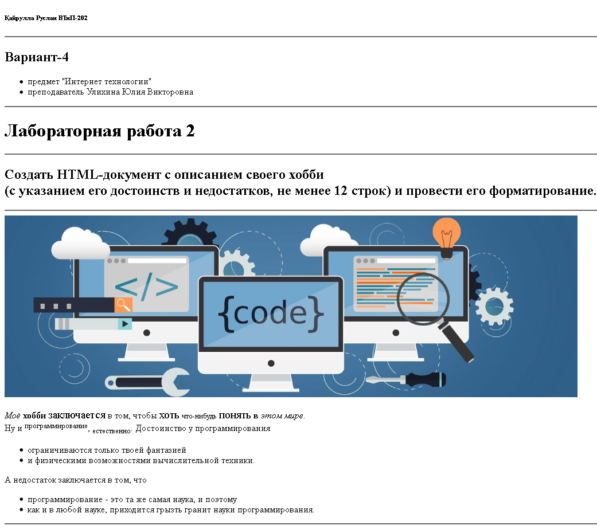

<!DOCTYPE html>
<html lang="en">
	<head>
		<meta charset="UTF-8">
	</head>
	
<body>
		<H6>Қайрулла Руслан ВТиП-202</H6>
<hr>
		<H2>Вариант-4</H2>
		<ul>
		<li>предмет "Интернет технологии"
		<li>преподаватель Улихина Юлия Викторовна
		</ul>
		<hr>
		<H1>Лабораторная работа 2</H1>
<hr>
		<H2>Создать HTML-документ с описанием своего хобби<br> (с указанием его достоинств и недостатков, не менее 12 строк) и провести его форматирование.</H2>
<hr>
		
		<p>
		<em>Моё</em>
		 <b>хобби</b> <big>заключается</big> в том, чтобы <big>хоть</big> <small>что-нибудь</small> <big>понять</big> <b>в</b> <em>этом мире</em>.<br>
		Ну и <sup>программирование</sup>, <sub>естественно</sub>. Достоинство у программирования<br>
		<ul>
		 <li>ограничиваются только твоей фантазией
		 <li>и физическими возможностями вычислительной техники.
		</ul>
		 А недостаток заключается в том, что
		<ul>
		 <li>программирование - это та же самая наука, и поэтому <li>как и в любой науке, приходится грызть гранит науки программирования.
		</ul></p>
<hr>




# Исходный код страницы HTML
```
<!DOCTYPE html>
<html lang="en">
	<head>
		<meta charset="UTF-8">
		<title>ВТиП-202_Қайрулла_лр1</title>
	</head>
	<body>
		<H6>Қайрулла Руслан ВТиП-202</H6>
		<hr>
		<H2>Вариант-4</H2>
		<ul>
		<li>предмет "Интернет технологии"
		<li>преподаватель Улихина Юлия Викторовна
		</ul>
		<hr>
		<H1>Лабораторная работа 2</H1>
		<hr>
		<H2>Создать HTML-документ с описанием своего хобби<br> (с указанием его достоинств и недостатков, не менее 12 строк) и провести его форматирование.</H2>
<hr>
		
		<p>
		<em>Моё</em>
		 <b>хобби</b> <big>заключается</big> в том, чтобы <big>хоть</big> <small>что-нибудь</small> <big>понять</big> <b>в</b> <em>этом мире</em>.<br>
		Ну и <sup>программирование</sup>, <sub>естественно</sub>. Достоинство у программирования<br>
		<ul>
		 <li>ограничиваются только твоей фантазией
		 <li>и физическими возможностями вычислительной техники.
		</ul>
		 А недостаток заключается в том, что
		<ul>
		 <li>программирование - это та же самая наука, и поэтому <li>как и в любой науке, приходится грызть гранит науки программирования.
		</ul></p>
		<hr>
	</body>
</html>
```
# Таблица из изученных тегов и их действий:

<table>
<thead>
	<tr>
		<th>№</th>
		<th>Тег</th>
		<th>Значение</th>
	</tr>
</thead>
<tbody>
	<tr>
		<td>01</td>
		<td><xmp><html></xmp><br><xmp>...</xmp><br><xmp></html></xmp></xmp></td>
		<td>HTML документ - обязательный</td>
	</tr>
	
	<tr>
	    <td>02</td>
	    <td><xmp><head></xmp><br><xmp>...</xmp><br><xmp></head></xmp></xmp></td>
	    <td>находятся метатеги, которые используются для хранения информации предназначенной для браузеров и поисковых систем. Например, механизмы поисковых систем обращаются к метатегам для получения описания сайта, ключевых слов и других данных</td>
	</tr>
	
	<tr>
	    <td>03</td>
	    <td><xmp><body></xmp><br><xmp>...</xmp><br><xmp></body></xmp>
	    <td>
	        <ul>
	            <li>предназначен для хранения содержания веб-страницы (контента), отображаемого в окне браузера
	            <li>также применяется для определения цветов ссылок и текста на веб-странице
	            <li>используется для размещения обработчика событий, например, onload, которое выполняется после того, как документ завершил загрузку в текущее окно или фрейм
	        </ul>
	   </td>
    </tr>
    
    <tr>
        <td>04</td>
        <td><xmp><hr></xmp></td>
        <td>рисует горизонтальную линию, которая по своему виду зависит от используемых параметров, а также браузера. Тег <xmp><hr></xmp> относится к блочным элементам, линия всегда начинается с новой строки, а после нее все элементы отображаются на следующей строке</td>
    </tr>
    
    <tr>
        <td>05</td>
        <td><xmp><h6>...</h6></xmp></td>
        <td>устанавливает заголовок шестого уровня</td>
    </tr>
    
    <tr>
        <td>06</td>
        <td><xmp><h5>...</h5></xmp></td>
        <td>устанавливает заголовок пятого уровня</td>
    </tr>
    
    <tr>
        <td>07</td>
        <td><xmp><h4>...</h4></xmp></td>
        <td>устанавливает заголовок четвертого уровня</td>
    </tr>
    
    <tr>
        <td>08</td>
        <td><xmp><h3>...</h3></xmp></td>
        <td>устанавливает заголовок третьего уровня</td>
    </tr>
    
    <tr>
        <td>09</td>
        <td><xmp><h2>...</h2></xmp></td>
        <td>представляет собой заголовок второго уровня. Текст внутри тега отображается крупным шрифтом жирного начертания</td>
    <tr>
    
    <tr>
        <td>10</td>
        <td><xmp><h1>...</h1></xmp></td>
        <td>отображается самым крупным шрифтом жирного начертания, всегда начинаются с новой строки, а после них другие элементы отображаются на следующей строке, перед заголовком и после него добавляется пустое пространство</td>
    </tr>
    
    <tr>
        <td>11</td>
        <td><xmp></xmp></td>
        <td>предназначен для отображения на веб-странице изображений в графическом формате GIF, JPEG или PNG, адрес файла с картинкой задаётся через атрибут src="..."</td>
    </tr>
    
    <tr>
        <td>12</td>
        <td><xmp><p>...</p></xmp></td>
        <td>всегда начинается с новой строки, абзацы текста идущие друг за другом разделяются между собой отбивкой</td>
    </tr>
    
    <tr>
        <td>13</td>
        <td><xmp><ul></xmp><br><xmp><li>...</li></xmp><br><xmp></ul></xmp></td>
        <td>тег <xmp><ul></xmp> устанавливает маркированный список. Каждый элемент списка должен начинаться с тега <xmp><li></xmp>. Если к тегу <xmp><ul></xmp> применяется таблица стилей, то элементы <xmp><li></xmp> наследуют эти свойства</td>
    </tr>
    
    <tr>
        <td>14</td>
        <td><xmp><b>...</b></xmp></td>
        <td>устанавливает жирное начертание шрифта. Допустимо использовать этот тег совместно с другими тегами, которые определяют начертание текста</td>
    </tr>
    
    <tr>
        <td>15</td>
        <td><xmp><em>...</em></xmp></td>
        <td>предназначен для акцентирования текста, браузеры отображают такой текст курсивным начертанием</td>
    </tr>
    
    <tr>
        <td>16</td>
        <td><xmp><big>...</big></xmp></td>
        <td>увеличивает размер шрифта на единицу по сравнению с обычным текстом, допускается применение вложенных тегов <xmp><big></xmp>, при этом размер шрифта будет больше с каждым уровнем</td>
    </tr>
    
    <tr>
        <td>17</td>
        <td><xmp><small>...</small></xmp></td>
        <td>уменьшает размер шрифта на единицу по сравнению с обычным текстом, допускается применение вложенных тегов <xmp><small></xmp>, при этом размер шрифта будет меньше с каждым вложенным уровнем, но не может быть меньше, чем 1</td>
    </tr>
    
    <tr>
        <td>18</td>
        <td><xmp><sup>...</sup></xmp></td>
        <td>отображает шрифт в виде верхнего индекса, шрифт при этом отображается выше базовой линии текста и уменьшенного размера</td>
    </tr>
</tbody>
</table>
</body>
</html>
